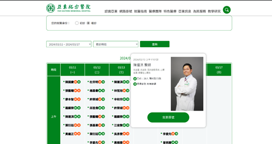
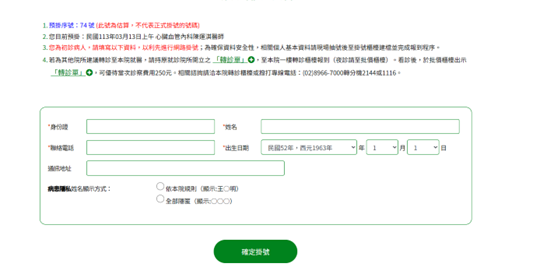
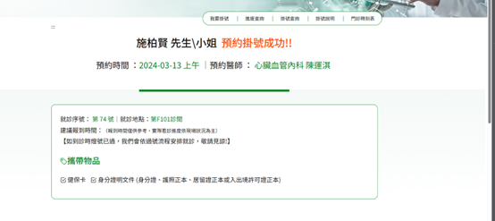
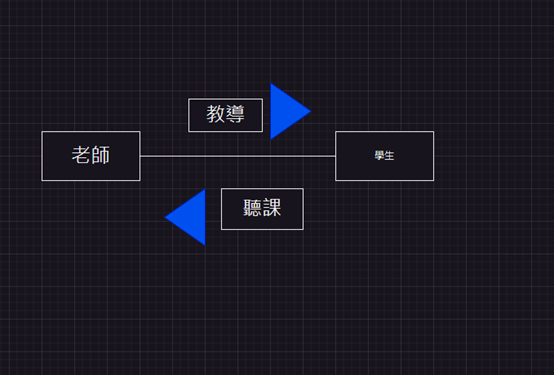

# 第2次作業-作業-HW2
>
>學號：111111209    
> 
>姓名：施柏賢
> 
>作業撰寫時間：120 (mins，包含程式撰寫時間)
> 
>最後撰寫文件日期：2023/03/20
>
選擇日期和醫師

填寫個人資料

掛號完成

開始寫說明，需要說明本次作業個人覺得需學會那些觀念，亦可作為學習筆記使用 (需寫成文章，需最少50字，並且文內不得有你、我、他三種文字)

老師教課 學生聽課